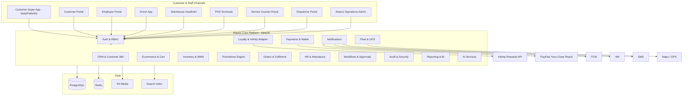
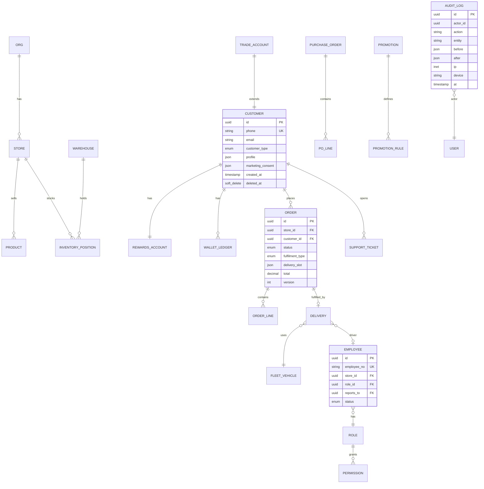

# Aheers Group — Enterprise Retail Ecosystem Specification

**Document type:** BRD · FRS · CRM · POS · Loyalty · Inventory · UX · Security · Deployment  
**Version:** 2.0 · Production-target specification  
**Platform:** Aheers Group Enterprise Platform (mini-ERP + CRM + Ecommerce + Loyalty + Fleet + HR + POS)  
**Scale target:** 50+ stores · 500+ employees · 100+ vehicles · 100,000+ customers

---

## Document index

| Document | Contents |
|----------|----------|
| **This file** | Architecture, modules, database, API, workflows, roadmap |
| [SCREEN-INVENTORY.md](./SCREEN-INVENTORY.md) | Every screen by portal — purpose, roles, permissions |
| [RBAC-PERMISSIONS.md](./RBAC-PERMISSIONS.md) | Roles, hierarchy, permission matrix, communication rules |
| [SUPER-APP-MASTER-PLAN.md](./SUPER-APP-MASTER-PLAN.md) | Phase 1 CRM/POS-first strategy & demo mapping |

---

## 1. Executive summary

Aheers Group operates **multiple retail businesses under one umbrella**. The system is **not an ecommerce app** — it is a **Retail ERP + CRM + HR + Fleet + Warehouse + Ecommerce + Loyalty + Delivery + POS ecosystem**.

Comparable references: Checkers Sixty60, Makro, Boxer, PnP asap!, Takealot, Walmart, Costco, Builders, SAP B1, Odoo, Zoho CRM, Sage Evolution, Uber Driver, Google Fleet.

### Core principles

1. **One customer identity** — one account, one rewards card, one wallet, one profile, one purchase history.
2. **Multi-store tenancy** — Supermarket, PowerTrade, Hardware (Build & Save), Grab n Go; future stores plug in without architecture change.
3. **Single-store cart** — shop one store at a time; switching clears cart with warning: *"Changing stores will remove products from your current cart."*
4. **CRM & POS first** — ecommerce consumes centralized stock, pricing, promotions, rewards (Phase 1–2 before full Super App).
5. **Every action permission-controlled** — RBAC on pages, buttons, reports, APIs; full audit trail.
6. **Omnichannel fulfilment** — picking → packing → dispatch → live GPS → POD → returns.

---

## 2. Business structure & customer types

### 2.1 Store tenants

| Code | Brand | Format |
|------|-------|--------|
| `supermarket` | Aheers Supermarket | Grocery retail |
| `powertrade` | Aheers PowerTrade Cash & Carry | Wholesale B2B |
| `hardware` | Aheers Hardware / Build & Save | Building, tools, contractor |
| `grabngo` | Aheers Grab n Go | Convenience, express |
| `foodworks` | Aheers Foodworks | Fresh food / deli (optional format) |

### 2.2 Customer types

| Type | Capabilities |
|------|----------------|
| **Retail** | Shop online/in-store, earn/redeem rewards, specials |
| **Rewards member** | Member pricing, cashback, points, coupons, promotions |
| **Wholesale** (PowerTrade) | Trade accounts, bulk pricing, quotes, RFQ, credit limits |
| **Contractor** (Hardware) | Project quotes, bulk buy, scheduled heavy delivery |
| **Franchise** (future) | Isolated catalog slice, revenue share, local ops |

### 2.3 Store-switch behaviour

When customer switches store:

- Cart cleared (after confirmation)
- Pricing rules reload (retail / member / wholesale / contractor)
- Promotions reload (store-scoped)
- Inventory scope reload
- Delivery rules reload (zones, min order, express eligibility)

---

## 3. System architecture



### 3.1 Technology stack

| Layer | Technology |
|-------|------------|
| Web / PWA | Next.js 15, React 19, TypeScript, Tailwind, ShadCN |
| Mobile | React Native (Expo) — customer, driver, warehouse |
| API | NestJS, JWT, OAuth 2.0, WebSockets (fleet, chat) |
| Database | PostgreSQL 16, multi-tenant row-level security |
| Cache | Redis (sessions, cart, catalog, rate limits) |
| Search | PostgreSQL FTS + optional Meilisearch |
| Media | Cloudflare R2 |
| Queue | BullMQ (notifications, sync, reports) |
| Hosting | Docker, Kubernetes, Cloudflare |
| BI | Power BI connector, Excel/PDF export |

---

## 4. Login portals (separate entry points)

| Portal | URL (example) | Auth methods |
|--------|---------------|--------------|
| Customer | `/login` | Email, phone OTP, Google, Facebook, Apple, biometric |
| Employee | `/staff/login` | Employee #, email, OTP, 2FA, biometric |
| Driver | `/driver/login` | Driver ID, OTP, device binding |
| Supplier | `/supplier/login` | Supplier account, 2FA |
| Contractor | `/contractor/login` | Business account |
| Wholesale | `/trade/login` | Trade account, VAT-verified |
| Dispatcher | `/dispatch/login` | Employee RBAC role |
| Service counter | `/counter` | POS-linked employee session |

**Session:** multi-device support, device management, session revoke, failed-login lockout, geo/IP policies per role.

---

## 5. Role hierarchy & RBAC

```
CEO
 └── Executive Team
      └── Regional Managers
           └── Store Managers
                └── Department Managers
                     └── Supervisors
                          └── Staff
```

**Parallel trees:** Warehouse Manager → Pickers/Packers; Fleet Manager → Drivers; CRM Manager → Agents; Finance Manager → Accounts.

See [RBAC-PERMISSIONS.md](./RBAC-PERMISSIONS.md) for full matrix.

### 5.1 Communication rules (internal chat)

- Staff → Supervisor only (not skip-level without escalation)
- Escalation chain: Staff → Supervisor → Dept Manager → Store Manager → Regional → Executive → CEO
- Warehouse ↔ Warehouse Manager; Drivers ↔ Dispatchers only
- Cashiers **cannot** message CEO directly
- Customer ↔ Driver via **masked in-app** channel (no personal numbers exposed)

### 5.2 Approval workflows

| Request type | Approval chain |
|--------------|----------------|
| PO & supplier payment | Staff → Supervisor → Manager → Finance → Executive (threshold-based) |
| Refunds / returns | Agent → Supervisor → Manager (amount thresholds) |
| Promotions / discounts | Marketing → Store Manager → Regional |
| Stock write-off | Inventory Controller → Warehouse Mgr → Store Mgr |
| Leave / overtime | Staff → Supervisor → HR → Store Mgr |
| Capex / vehicles | Manager → Regional → Executive → CEO |

---

## 6. Customer Super App — functional specification

### 6.1 Splash screen

Logo, promotions banner, latest specials, rewards benefits, app version, loading animation.

### 6.2 Home screen

Welcome, rewards summary, wallet/cashback/points, promotions carousel, flash sales, weekly specials, featured/recent/recommended products, nearby store, current store, store switch, quick reorder, digital rewards card, notifications.

### 6.3 Store selector cards

Per store: image, logo, description, specials, open status, hours, delivery/pickup, minimum order, distance.

### 6.4 Product catalogue (all stores)

**Fields:** SKU, barcode, name, brand, category, subcategory, department, supplier, cost/retail/wholesale/member/contractor/promo prices, tax, unit, weight, dimensions, descriptions, specs, ingredients, nutrition, safety, images, video, documents, warranty, origin, stock (store/warehouse), reorder levels, expiry, batch, tags, attributes, variants.

**Department catalogues:** see Section 6.5–6.8 in screen inventory.

### 6.5 Search

Keyword, voice, barcode scan, category, brand, price, promotion, availability, store scope, predictive search, AI recommendations, recent/popular searches.

### 6.6 Cart & checkout

Single-store cart; coupon, gift card, points, cashback, member pricing, savings view, delivery/pickup estimates, tax, notes, save/recover cart, abandoned cart recovery.

**Checkout:** home delivery, pickup, curbside, scheduled slots, same-day, express (30/60/90 min), pay in store, split pay, wallet, rewards, card, EFT, Yoco, PayFast, Ozow, Peach.

### 6.7 Order management (customer)

Track, cancel (rules), modify (pre-pick), refund/return request, invoice/statement download, reorder, review, support contact.

### 6.8 Customer delivery portal

**My Deliveries:** upcoming, in progress, completed, cancelled, failed, returned.

**Live tracking:** order status, driver name/photo (masked), vehicle type/reg, ETA, GPS map, remaining stops, delivery notes.

**Notifications:** order accepted → picked → packed → driver assigned → en route → nearby → delivered / failed — via push, SMS, email, WhatsApp.

---

## 7. Loyalty & Infinity Rewards

Digital card, barcode, QR, membership number.

| Feature | Detail |
|---------|--------|
| Points | Earn, redeem, bonus events, tier multipliers |
| Cashback | 1% qualifying (per Aheers programme), redeem at checkout |
| Tiers | Bronze, Silver, Gold, Platinum, VIP — different rates & exclusives |
| Events | Referral, birthday, anniversary, store visit, review, campaign |
| Integration | Infinity Rewards API — balance sync, transaction post, digital card |

---

## 8. CRM — enterprise specification

### 8.1 Customer 360

Purchases, rewards, visits, calls, emails, WhatsApps, tickets, complaints, returns, refunds, marketing engagement, web/app activity, store visits, CLV, risk score, loyalty score.

### 8.2 Sales CRM

Leads, prospects, opportunities, deals, accounts, tasks, appointments, follow-ups, notes, targets, commission.

### 8.3 Customer service

Tickets, complaints, escalations, SLA, knowledge base, live chat, WhatsApp, email, call logging.

### 8.4 Service counter portal (critical for Aheers)

Staff at till/service desk can:

- Create orders on behalf of customer (phone/WhatsApp walk-in)
- Lookup customer & apply rewards card
- Schedule delivery & take EFT confirmation
- Track order status on one screen
- Apply manager overrides (with approval workflow)

---

## 9. Inventory & warehouse (WMS)

Multi-store inventory, central warehouse, store warehouses, transfers, adjustments, cycle counts, receiving, dispatch, returns, damaged, expiry, batch, serial, POs, supplier orders, barcode/RF scanning.

**Picking workflow:**

```
Order Created → Picking Queue → Picker Assigned → Picked → Packed
→ QC → Ready for Dispatch → Driver Assigned → Out for Delivery → Delivered (POD)
```

**Warehouse roles:** Manager, Receiving Clerk, Picker, Packer, Loader, Dispatcher, Inventory Controller — each sees only assigned work/areas.

---

## 10. POS specification

Real-time sync with central inventory & CRM.

| Capability | Detail |
|------------|--------|
| Checkout | Basket, tenders, split pay |
| Customer lookup | Phone, card scan, account # |
| Rewards | Member pricing, points earn/redeem, cashback |
| Gift cards / store credit | Issue & redeem |
| Receipts | Print/email/WhatsApp |
| Returns / refunds | Workflow + approval |
| Offline mode | Queue sync when reconnected |

Hardware: scanners, printers, cash drawers, customer displays — compatible device guidance during implementation.

---

## 11. Promotions engine

Weekly/weekend specials, flash sales, BOGO, spend-and-save, combos, category %, supplier-funded, rewards-exclusive, store/location/holiday/birthday/loyalty campaigns, competitions, lucky draws.

Rule evaluation at: cart recalc, POS scan, checkout auth.

---

## 12. Marketing automation

Email, SMS, WhatsApp, push; customer journeys; abandoned cart; win-back; birthday; loyalty; referral; product recommendations; geo-targeted promos.

---

## 13. Fleet & delivery management

### 13.1 Vehicle registry

Reg, license/insurance expiry, type, capacity, driver, fuel, service schedule, maintenance, accidents, mileage, GPS device, tracker status.

**Types:** motorbike, bakkie, panel van, truck, heavy truck, forklift.

### 13.2 Driver management

License, PDP, medical, training, performance, delivery scores, customer ratings, attendance, incidents.

### 13.3 Dispatcher portal

Available/active/offline drivers, vehicle map, waiting orders, late deliveries, manual/auto assign, route optimization (distance, fuel, traffic, windows, capacity).

### 13.4 Driver app

Today's route, stops, navigation, order detail, POD (signature, photo, GPS), failed delivery reasons + photos, vehicle inspection, fuel logs.

### 13.5 Live GPS

Driver/vehicle position, route progress, geofencing, speed violations, idle time, ETA, route deviation alerts.

### 13.6 Delivery analytics

Avg time, on-time %, driver/customer ratings, fuel cost, cost per delivery, utilization, failed/return rates, revenue per route.

---

## 14. Employee & HR module

Employee ID, photo, dept, store, position, salary band, status, emergency contacts, reviews, training, warnings, disciplinary, attendance, leave, payroll refs, documents, uniforms, equipment.

**Attendance:** clock in/out, GPS/biometric/face verify, shifts, breaks, overtime, absence, leave.

**Tasks:** managers assign stock counts, promotions, audits, deliveries, training; track completion & overdue.

---

## 15. Business intelligence

Dashboards per role (customer, employee, driver, warehouse, store, CRM, marketing, finance, executive, CEO).

**Metrics:** revenue, profit, margin, orders, customers, inventory, promotions, rewards, cashback, per-store format performance, suppliers, categories, employees, delivery KPIs.

**AI (phase 4+):** route optimization, recommendations, demand/inventory forecast, segmentation, promotion suggestions, delivery prediction, fraud, churn.

---

## 16. Database design (core ERD)



### 16.1 Cross-cutting DB rules

- **Multi-tenant:** `org_id` on all business tables; RLS policies by store access
- **Soft deletes:** `deleted_at` on master data
- **Version history:** `version` + `audit_log` for financial/inventory
- **Indexes:** phone, barcode, SKU per store, order(customer_id, created_at), fleet GPS time-series

Full table list: **142 tables** — see Appendix A (abbreviated in implementation migrations).

---

## 17. API specification (v1 prefix `/api/v1`)

### 17.1 Auth

`POST /auth/customer/register` · `/auth/customer/login` · `/auth/otp/send` · `/auth/otp/verify`  
`POST /auth/oauth/{provider}` · `/auth/employee/login` · `/auth/driver/login`  
`POST /auth/refresh` · `/auth/logout` · `GET /auth/devices` · `DELETE /auth/devices/{id}`

### 17.2 Stores & catalog

`GET /stores` · `GET /stores/{slug}` · `GET /stores/{slug}/catalog`  
`GET /products/{id}` · `GET /search?q=&store=&barcode=`

### 17.3 Cart & checkout

`GET /cart` · `POST /cart/items` · `PATCH /cart/items/{id}` · `DELETE /cart`  
`POST /cart/switch-store` (returns warning if items exist)  
`POST /checkout/quote` · `POST /checkout/place` · `POST /checkout/pay`

### 17.4 Orders & delivery

`GET /orders` · `GET /orders/{id}` · `GET /orders/{id}/tracking` (WebSocket upgrade)  
`POST /orders/{id}/cancel` · `POST /orders/{id}/return`

### 17.5 Rewards & wallet

`GET /rewards` · `GET /rewards/card` · `POST /rewards/redeem`  
`GET /wallet` · `POST /wallet/topup`

### 17.6 CRM (admin)

`GET /crm/customers` · `GET /crm/customers/{id}/360` · `PATCH /crm/customers/{id}`  
`GET /crm/tickets` · `POST /crm/tickets` · `POST /crm/counter-orders` (service desk)

### 17.7 Inventory & WMS

`GET /inventory` · `POST /inventory/adjust` · `POST /inventory/transfer`  
`GET /wms/pick-queue` · `PATCH /wms/picks/{id}`

### 17.8 Fleet & dispatch

`GET /fleet/vehicles` · `WS /fleet/live`  
`POST /dispatch/assign` · `POST /dispatch/optimize-route`  
`PATCH /deliveries/{id}/status` · `POST /deliveries/{id}/pod`

### 17.9 HR, approvals, audit

`GET /hr/employees` · `POST /hr/attendance/clock`  
`GET /approvals/pending` · `POST /approvals/{id}/decide`  
`GET /audit?entity=&actor=&from=&to=`

---

## 18. Security architecture

| Control | Implementation |
|---------|----------------|
| 2FA | TOTP/SMS for staff, optional customers |
| Biometric | Mobile secure enclave |
| Device binding | Driver devices registered |
| IP/geo restrictions | Admin roles |
| Session tracking | Redis + revoke |
| Fraud detection | Velocity rules, AI phase 4 |
| POPIA | Consent, export, erasure requests |
| PCI | Tokenized payments only |
| Encryption | TLS 1.3, at-rest PG encryption |

---

## 19. Deployment & disaster recovery

| Item | Approach |
|------|----------|
| Environments | dev · staging · prod |
| CI/CD | GitHub Actions → Docker → K8s |
| DB backups | Daily full + WAL continuous, 30-day retention |
| RPO / RTO | 1h / 4h target |
| Multi-region | Primary JHB, DR CPT (phase 3) |
| CDN | Cloudflare for static & edge |
| Secrets | Vault / K8s secrets |

---

## 20. Development roadmap (CRM & POS first)

| Phase | Months | Deliverables |
|-------|--------|--------------|
| **1 Foundation** | 1–3 | DB, auth, RBAC, employee HR basics, audit |
| **2 CRM + POS + Inventory** | 3–6 | Customer 360, Infinity adapter, POS sync, promotions v1, service counter |
| **3 Super App web** | 6–8 | Store selector, cart, checkout, customer delivery portal |
| **4 Fleet + WMS** | 8–10 | Dispatcher, driver app, picking workflow, GPS |
| **5 Mobile + B2B** | 10–12 | RN customer app, wholesale/contractor portals |
| **6 Scale** | 12+ | AI, BI, franchise toolkit, multi-region |

**Sprint 1–6:** scaffold, auth, stores/catalog, inventory/POS, rewards, CRM admin (no ecommerce until S7).

---

## 21. Demo application mapping (`aheers-demo`)

| Spec module | Demo route | Status |
|-------------|------------|--------|
| Super App hub | `/` | Prototype |
| Store selector + cart rule | `/` + modal | Prototype |
| 5 store formats | `/store/{slug}` | Prototype |
| Infinity Rewards portal | `/portal` | Mock |
| Delivery tracking | `/portal/deliveries` | Prototype |
| Login portals index | `/login` | Stub |
| Operations CRM | `/admin/*` | Prototype |
| Fleet / dispatcher | `/admin/fleet` | Prototype |
| Service counter | `/admin/service-desk` | Prototype |
| Driver portal | `/driver` | Prototype |
| Trade portal | `/trade` | Prototype |
| RBAC / employee | — | Spec only |
| POS live sync | — | Phase 2 |
| NestJS + PostgreSQL | — | Phase 1 |

---

## Appendix A — Core database tables (grouped)

**Org & stores:** `organizations`, `stores`, `store_settings`, `departments`, `warehouses`  
**Users & RBAC:** `users`, `roles`, `permissions`, `role_permissions`, `user_roles`, `communication_policies`  
**Customers:** `customers`, `customer_addresses`, `customer_payment_methods`, `rewards_accounts`, `wallet_ledger`, `trade_accounts`, `contractor_accounts`  
**Catalog:** `categories`, `products`, `product_variants`, `product_media`, `barcodes`, `price_lists`, `price_rules`  
**Inventory:** `inventory_positions`, `stock_movements`, `stock_transfers`, `stock_counts`, `batches`, `purchase_orders`, `suppliers`  
**Commerce:** `carts`, `cart_items`, `orders`, `order_lines`, `payments`, `refunds`, `returns`  
**Fulfilment:** `deliveries`, `delivery_slots`, `delivery_events`, `proof_of_delivery`, `pick_tasks`, `pack_tasks`  
**Fleet:** `fleet_vehicles`, `fleet_maintenance`, `gps_positions`, `fuel_logs`, `routes`  
**HR:** `employees`, `attendance`, `leave_requests`, `tasks`, `performance_reviews`  
**CRM:** `leads`, `opportunities`, `tickets`, `ticket_messages`, `campaigns`, `segments`  
**Promotions:** `promotions`, `promotion_rules`, `coupons`, `competitions`  
**System:** `audit_logs`, `notifications`, `approval_requests`, `settings`, `documents`

---

*End of Enterprise Specification v2.0 · Aheers Group*
