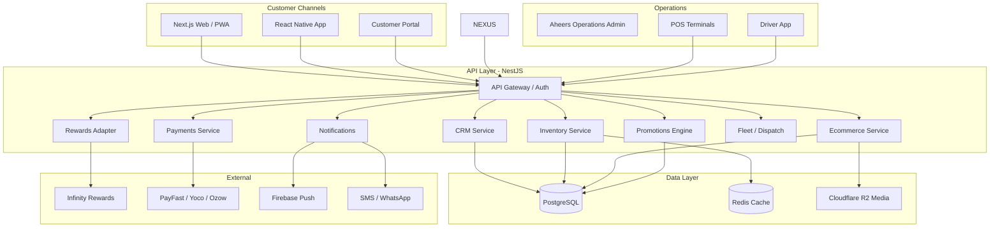
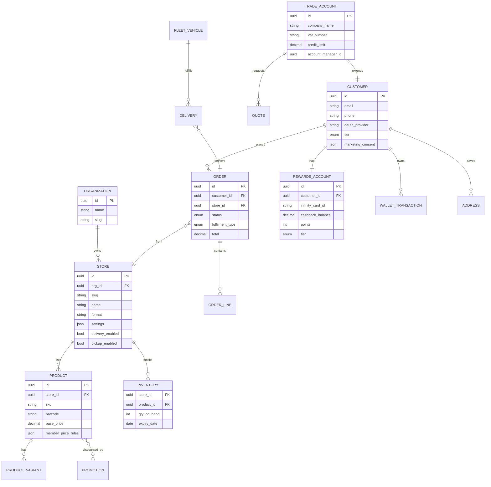

# Aheers Group Super App — Master Architecture & Implementation Plan

**Platform:** AHEERS GROUP SUPER APP (Omnichannel CRM + Ecommerce)  
**Platform:** Aheers Group Enterprise Platform  
**Client:** [Aheers Group](https://www.aheers.co.za) · Greytown, KZN  
**Strategy:** One Super App · Multi-store · Single account · CRM & POS first, ecommerce second

---

## 1. Executive Summary

Aheers Group operates multiple retail formats under one parent brand. The correct architecture is **one Super App** (web + mobile + PWA) with **multi-store tenancy** — the same pattern used by Checkers Sixty60, Makro, Builders, and Walmart.

Customers register once, use one Infinity Rewards card, one wallet, and one login — but **shop one store at a time** per cart session.

**Recommended build order (agreed):**

| Phase | Focus | Why |
|-------|--------|-----|
| **1** | CRM + Customer 360 + Rewards sync | Unified customer data is the foundation |
| **2** | POS + Inventory + Promotions engine | Real stock, pricing, member pricing at till |
| **3** | Ecommerce + Customer app | Online layer plugs into existing data |
| **4** | Fleet + Wholesale B2B + Hardware modules | Format-specific features on stable core |
| **5** | Marketing automation + BI | Scale retention and reporting |

---

## 2. Business Structure (Store Tenants)

| # | Brand | Slug | Format | Primary location |
|---|-------|------|--------|------------------|
| 1 | Aheers Supermarket | `supermarket` | Grocery retail | 93 Voortrekker St, Greytown |
| 2 | Aheers PowerTrade Cash & Carry | `powertrade` | Wholesale / B2B | 93 Durban St, Greytown |
| 3 | Aheers Build & Save | `buildsave` | Hardware / building | Greytown (expandable) |
| 4 | Aheers Foodworks | `foodworks` | Food / deli format | Group portfolio |
| 5 | Aheers Grab n Go | `grabngo` | Convenience / takeaway | Voortrekker St (deli counter) |

Future stores plug in as new **tenant records** — no new app builds.

### Infinity Rewards (existing)

Per [aheers.co.za/rewards-programme](https://aheers.co.za/rewards-programme):

- Member-only pricing on selected items
- 1% cashback on qualifying purchases
- Digital card via Infinity Rewards App
- Load change onto card at checkout
- Network partner redemptions beyond Aheers

**Integration approach:** Infinity Rewards API/webhook adapter — sync card balance, tier, and transaction events bidirectionally with POS and ecommerce.

---

## 3. System Architecture



### Multi-store cart rule

```
User selects Store A → adds items → cart.store_id = A
User taps Store B → IF cart not empty → modal:
  "Your current cart will be cleared if you switch stores."
  [Cancel] [Clear cart & switch]
```

Enforced at: API gateway, cart service, and client (demo implements client + context).

---

## 4. Database Design (PostgreSQL ERD — Core)



### Key indexes

- `product(store_id, category_id, is_active)`
- `inventory(store_id, product_id)` unique
- `order(customer_id, created_at DESC)`
- `customer(phone)` unique — SA mobile-first login

---

## 5. User Flows

### 5.1 Onboarding

```
Splash → Register/Login (OTP / OAuth) → Link Infinity card (optional)
→ Customer Dashboard → Store Selector → Shop
```

### 5.2 Shop (single-store cart)

```
Store Selector → Category browse → Product detail → Add to cart
→ Cart (rewards/wallet/voucher) → Checkout (delivery|collection|pay-in-store)
→ Payment → Order confirmation → Track in portal / push
```

### 5.3 Store switch with active cart

```
User on PowerTrade with 3 items → taps Supermarket
→ Modal warning → Confirm → cart cleared → Supermarket catalog
```

### 5.4 Wholesale (PowerTrade)

```
Business register → VAT verify → Trade account approval
→ B2B portal → RFQ → Quote → PO → Bulk order → Fleet delivery
```

### 5.5 Rewards at checkout (POS + online)

```
Swipe / scan digital card → Apply member price rules
→ Calculate cashback accrual → Deduct wallet/cashback if requested
→ Post to Infinity Rewards API
```

---

## 6. API Design (NestJS — REST + WebSocket)

**Base:** `https://api.aheers.co.za/v1` (or tenant subdomain)

| Domain | Endpoints (sample) |
|--------|-------------------|
| Auth | `POST /auth/register`, `/auth/login`, `/auth/otp`, `/auth/oauth/{provider}` |
| Stores | `GET /stores`, `GET /stores/{slug}`, `GET /stores/{slug}/catalog` |
| Cart | `GET /cart`, `POST /cart/items`, `DELETE /cart`, `POST /cart/switch-store` |
| Orders | `POST /orders`, `GET /orders`, `GET /orders/{id}/tracking` |
| Rewards | `GET /rewards/balance`, `GET /rewards/card`, `POST /rewards/redeem` |
| Wallet | `GET /wallet`, `POST /wallet/topup`, `POST /wallet/pay` |
| Promotions | `GET /promotions`, `POST /promotions/apply-coupon` |
| CRM (admin) | `GET /crm/customers`, `PATCH /crm/customers/{id}`, `GET /crm/segments` |
| Inventory | `GET /inventory`, `POST /inventory/adjust`, `POST /inventory/transfer` |
| Fleet | `GET /fleet/vehicles`, `WS /fleet/live`, `PATCH /deliveries/{id}/status` |
| B2B | `POST /trade/register`, `GET /trade/quotes`, `POST /trade/rfq` |

**Auth:** JWT access + refresh; role claims: `customer`, `store_admin`, `regional_admin`, `super_admin`.

---

## 7. UI/UX Design System

| Token | Value | Usage |
|-------|-------|-------|
| Primary | `#1B5E3B` | Aheers green — trust, fresh |
| Gold | `#C9A227` | Rewards, premium tier |
| PowerTrade | `#E65100` | Wholesale accent |
| Build & Save | `#455A64` | Hardware industrial |
| Foodworks | `#C62828` | Food / deli warmth |
| Grab n Go | `#00897B` | Speed, convenience |
| Admin UI | `#0D3D26` | Aheers operations (green-dark) |

**Typography:** Inter (UI), display serif for hero/marketing.  
**Components:** ShadCN + Tailwind (web), NativeWind (mobile).  
**Patterns:** Large store cards, bottom nav (mobile), rewards card always accessible, one-tap reorder.

---

## 8. CRM Design (Module Map)

| Module | Features |
|--------|----------|
| Customer 360 | Profile, CLV, segments, consent, notes |
| Loyalty | Infinity sync, tiers (Bronze→VIP), cashback history |
| Marketing | Campaigns, SMS/email/WhatsApp, abandoned cart |
| Support | Tickets, comms log, refunds |
| Sales | Pipeline (B2B quotes), trade accounts |
| Analytics | Cohort, retention, promotion ROI |

**Segments (examples):** VIP grocery, PowerTrade trader, inactive 90d, birthday this month, high cashback balance.

---

## 9. Rewards System Design

```
Infinity Rewards ←→ Rewards Adapter ←→ Aheers Platform
                              ↓
                    POS + Ecommerce + Portal
```

| Feature | Implementation |
|---------|----------------|
| Digital card | QR + barcode in app, wallet pass (Apple/Google) |
| Member pricing | Price rules engine per SKU + tier |
| Cashback 1% | Accrual on qualifying lines, post-settlement sync |
| Tiers | Bronze / Silver / Gold / Platinum / VIP — spend thresholds |
| Birthday / referral | Promotion engine triggers + CRM automation |
| Digital coupons | Unique codes linked to customer_id |

---

## 10. Promotions Engine

Rule types: weekly specials, flash sales, BOGO, spend-and-save, category %, member-exclusive, supplier-funded, competitions/lucky draws.

```json
{
  "type": "member_price",
  "store_ids": ["supermarket"],
  "conditions": { "rewards_tier": ["gold", "platinum", "vip"] },
  "action": { "discount_percent": 10, "sku_list": ["..."] }
}
```

Evaluated at: cart recalculation, POS basket scan, checkout authorization.

---

## 11. Admin Panel (Role-Based)

| Role | Access |
|------|--------|
| Super Admin | All orgs, all stores, billing |
| Regional Admin | Multi-store KZN region |
| Store Admin | Single store P&L, staff, inventory |
| Marketing | Promotions, campaigns, competitions |
| Finance | Invoices, trade credit, reports |
| Warehouse | POs, transfers, stock counts |
| Support | Tickets, refunds, customer lookup |

Dashboards: revenue, profit, per-store performance, rewards usage, top SKUs, wholesale vs retail split.

---

## 12. Mobile App (React Native)

Shared codebase with web where possible (Zustand/React Query, shared API types).

| Screen | Priority |
|--------|----------|
| Splash + auth | P1 |
| Dashboard + rewards card | P1 |
| Store selector | P1 |
| Catalog + product + cart | P1 |
| Checkout | P1 |
| Order tracking + fleet map | P2 |
| B2B portal (PowerTrade) | P2 |
| QR/barcode scan | P2 |
| Offline catalog cache | P3 |
| Dark mode + a11y | P3 |

Push: Firebase — order status, promotions, cashback earned.

---

## 13. Technology Stack (Confirmed)

| Layer | Choice |
|-------|--------|
| Web | Next.js 15, React 19, TypeScript, Tailwind, ShadCN |
| Mobile | React Native (Expo) |
| API | NestJS, JWT, OAuth |
| DB | PostgreSQL 16 |
| Cache | Redis |
| Media | Cloudflare R2 |
| Payments | PayFast, Yoco, Ozow, Peach |
| Push | Firebase |
| Hosting | Cloudflare, Docker, K8s |
| BI export | Power BI connector, Excel/PDF reports |

---

## 14. Development Roadmap

### Phase 1 — Foundation (Months 1–3) · CRM + POS + Inventory

- [ ] PostgreSQL schema + NestJS monorepo
- [ ] Auth (mobile OTP + OAuth)
- [ ] Customer 360 + Infinity Rewards adapter (read balance, post transactions)
- [ ] Multi-store inventory + central warehouse
- [ ] POS integration (real-time sync, member lookup, rewards redemption)
- [ ] Operations admin: CRM, inventory, basic reports
- [ ] Promotions engine v1 (member pricing, weekly specials)

**Exit criteria:** Till and back office share one customer record and stock file.

### Phase 2 — Omnichannel Core (Months 4–6)

- [ ] Super App web (store selector, single-store cart, checkout)
- [ ] Customer portal (orders, rewards, wallet)
- [ ] PayFast + wallet split payments
- [ ] Fleet tracker + driver status updates
- [ ] Marketing automation v1 (SMS, push, abandoned cart)

**Exit criteria:** Customer can order online with same rewards balance as in-store.

### Phase 3 — Format Modules (Months 7–9)

- [ ] PowerTrade B2B portal (trade accounts, quotes, bulk pricing)
- [ ] Build & Save catalog (contractor pricing, project quotes)
- [ ] Grab n Go express flow (10-min pickup)
- [ ] React Native app (iOS + Android)
- [ ] PWA + offline catalog

### Phase 4 — Scale (Months 10–12)

- [ ] Advanced BI + Power BI
- [ ] Automation workflows
- [ ] Franchise / new store onboarding toolkit
- [ ] Performance hardening, K8s autoscale

---

## 15. Sprint Planning (First 6 Sprints × 2 weeks)

| Sprint | Goal | Stories |
|--------|------|---------|
| S1 | Project scaffold | Monorepo, DB migrations, CI/CD, dev environments |
| S2 | Auth + customers | Register, OTP login, customer profile API |
| S3 | Stores + catalog | Multi-tenant stores, categories, products, barcodes |
| S4 | Inventory + POS sync | Stock levels, POS webhook, low-stock alerts |
| S5 | Rewards integration | Infinity adapter, digital card, member pricing rules |
| S6 | CRM admin UI | Customer list, 360 view, segments, operations dashboard |

Ecommerce sprints begin **S7** after POS path is validated in-store.

---

## 16. Demo App Mapping (Current `aheers-demo`)

The existing Next.js demo prototypes:

| Spec area | Demo route |
|-----------|------------|
| Super App hub | `/` |
| Store selector (BASH-style) | Top bar + `/` store cards |
| Single-store cart | Cart context + switch warning modal |
| Supermarket / PowerTrade / Grab n Go / Build & Save / Foodworks | `/store/{slug}` |
| Infinity Rewards portal | `/portal` |
| Operations CRM | `/admin` |
| Fleet tracker | `/admin/fleet` |

Demo uses mock data; production connects to NestJS + PostgreSQL per this document.

---

## 17. Non-Functional Requirements

| Requirement | Target |
|-------------|--------|
| API p95 latency | < 200ms |
| Uptime | 99.9% |
| Mobile Lighthouse | > 90 performance |
| POPIA | Consent, data export, retention policies |
| PCI | Tokenized payments — no card storage on Aheers servers |

---

## 18. Success Metrics

- Rewards enrolment rate (% of transactions linked to card)
- Repeat purchase rate within 30 days
- Cart abandonment recovery conversion
- Per-store online revenue mix
- Trade account order value (PowerTrade)
- Customer support resolution time
- Inventory accuracy (system vs physical count)

---

*Document version 1.0 · Aheers Group Super App*
